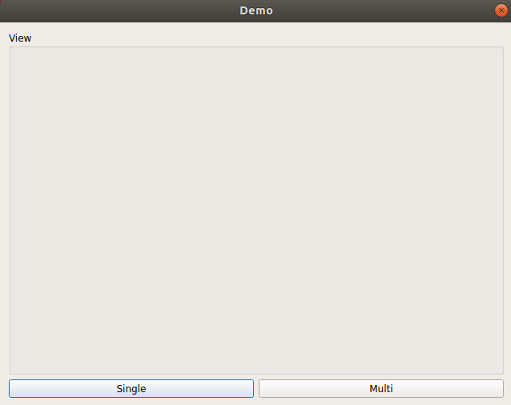
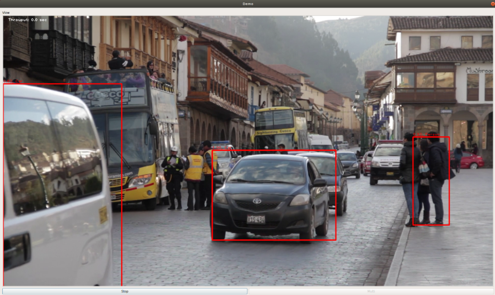
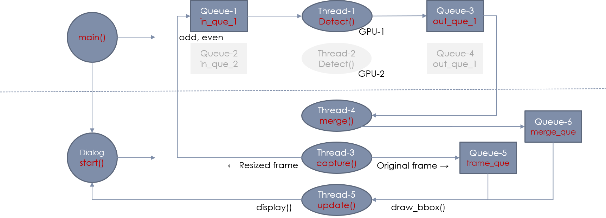
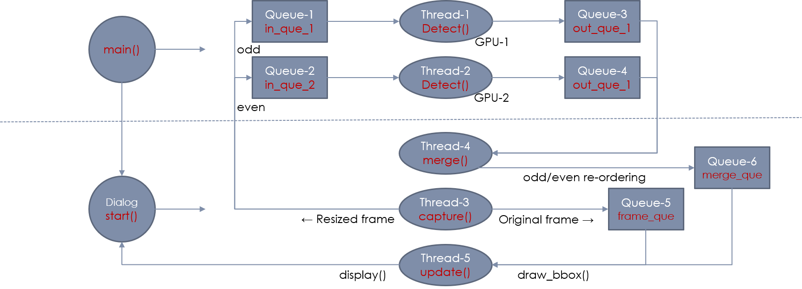

# PlaidML-Multi-GPU
A demo application of deep learning framework based on OpenCL for multi-GPUs

## 1. Environment
    - CPU: AMD Ryzen Threadripper 2970wx 24
    - GPU: AMD Radeon RX Vega 64 8GB (x2)

    - OS: Ubuntu Linux 18.04.3 LTS (linux kernel 5.1)

    - python==3.6.9
    - numpy==1.17.3
    - keras==2.2.4
    - tensorflow==1.13.1 (NOT!!! tensorflow-gpu)
    - pyqt==5.9.2
    - opencv==3.4.2
    - plaidml-keras==0.6.4  


## 2. Usage

##### Create Virtual Environment using `conda` (anaconda3 or miniconda3)
at root directory of PlaiML-Multi-GPU repository where has `environment.yml`
```
$ conda env create
$ conda activate plaidml_env
(plaidml_env) $
```

#####_Important:_

__1. This demo source code assumes that the currently running environment is equipped with two GPUs.__

__2. Use the modified plaidml's keras backend code accordingly, which is `src/backend.py`.__

__3. You must replace the original `backend.py` file of plaidml installed in the current environment with `src/backend.py` to operate normally.__  


#####_Example:_

```
$ pwd
/home/USER_HOME/PlaidML-Multi-GPU/
```

move where plaidml-keras package installed
```
$ cd /home/USER_HOME/miniconda3/envs/PLAIDML_ENV/lib/python3.6/site-packages/plaidml/keras/ 
```

change the original source file
```
$ mv backend.py backend.py.old
```

copy the customized `backend.py`
```
$ cp /home/USER_HOME/PlaidML-Multi-GPU/src/backend.py backend.py
```

##### Download pre-trained weight file to `weight/VGG_VOC0712_SSD_300x300_iter_120000.h5`
https://drive.google.com/open?id=121-kCXaOHOkJE_Kf5lKcJvC_5q1fYb_q

also you can find details here: 

https://github.com/pierluigiferrari/ssd_keras 

##### Start demo program
```
(plaidml_env) $ python main.py
```

## 3. Summary of demo system
The developed application contains the following components and functions.

1. __window view:__ This is the part where the video is output. The resolution of the video being played is adjusted.

2. __`Single` button:__ That is, it uses only 1 GPU out of 2 GPUs in action. The `Stop` button is activated during operation.

3. __`Multi` button:__ Both GPUs are used. The `Stop` button is activated during operation.

demo GUI shows like this:



The screen that executed the program by inputting a video file is as follows:



when using only 1-GPU:



when both GPUs are used:

